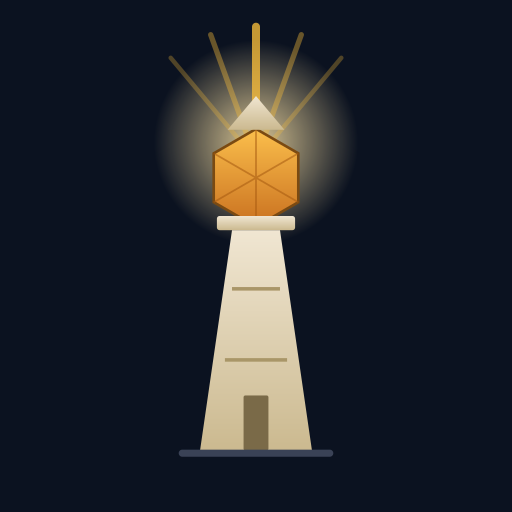

<p align="center">
  
</p>

# Beacon Table

**Гибридный self-hosted VTT (виртуальный игровой стол) для D&D и других настольных RPG**

[English summary ↓](#english-summary) · [Быстрый старт](#быстрый-старт) · [Возможности](#возможности)


---

## Что это

DM-инструмент для стола, который работает в двух режимах одновременно (не
взаимоисключающих — можно и то, и другое сразу на одной комнате):

- **Локально** — DM управляет сценой со своего устройства, ТВ/проектор в комнате
  показывает то же самое по локальной сети, без авторизации.
- **Через интернет** — DM расшаривает адрес своего self-hosted сервера, удалённые игроки заходят по логину/паролю, заводят
  персонажей, двигают токены и кидают кубы.

## Возможности

- Гибрид локал/интернет в одной комнате одновременно
- Динамическое освещение, line-of-sight от токенов (частично реализовано)
- Видео-фоны карт и анимированные токены (mp4/webm)
- Броски кубов
- Амбиент сцены + плейлисты ДМ
- Вики-заметки ДМ, бестиарий (личные монстры/NPC), библиотека заклинаний
- Состояния (ослепление/испуг/истощение…): быстрая палитра ДМ, значки на
  токенах, отсчёт длительности по раундам, свой конструктор состояний,
  набор «из коробки» под каждую систему мира
- Состояния и надетая экипировка меняют числа: КД, скорость,
  характеристики, максимум хитов, а «горит»/«регенерация» сами снимают или
  возвращают хиты в начале хода — с броском в общий лог
- Каталог "из коробки" на SRD 5.1/5.2 (CC-BY-4.0)
- Аккаунты и персонажи
- Импорт персонажей с сайта LSS
- Импорт предметов и заклинаний с ttg.club
- Импорт из Foundry VTT: как отдельного файла экспорта, так и целого
  модуля/системы по ссылке на манифест — см. ниже

## Скриншоты

| Окно ДМ | Окно игрока | Окно трансляции |
| --- | --- | --- |
|  |  |  |

## Быстрый старт

### Готовый исполняемый файл

Скачайте файл под вашу ОС/архитектуру со страницы
[Releases](https://github.com/major1ink/Beacon-Table/releases/latest) —
имя вида `beacon-table_<версия>_<ос>_<архитектура>` (`.exe` для Windows),
например `beacon-table_v0.1.0_linux_amd64`. Это готовый к запуску
исполняемый файл без установки.

```bash
chmod +x beacon-table_*        # Linux/macOS: GitHub не хранит бит "исполняемый"
./beacon-table_v0.1.0_linux_amd64
```
```powershell
.\beacon-table_v0.1.0_windows_amd64.exe
```

Перед первым запуском необходимо создать новую пустую папку. В нее поместить скаченный исполняемый файл.
При первом запуске рядом с исполняемым файлом создаются
папки `data/` (БД, аккаунты, ДМ-заметки) и `uploads/` (карты, токены). Далее после запуска необходимо перейти по адресу напечатнному в консоли.

Например:

- Окно ДМ или игрока: http://localhost:8080/
- На телевизоре или любом другом устройстве локальной сети для просмотра и трансляции http://localhost:8080/broadcast.html 

### Первый запуск на Windows: предупреждение SmartScreen

При запуске скачанного `.exe` Windows покажет окно **«Система Windows защитила
ваш компьютер»** с пометкой «Издатель: Неизвестный издатель».

Это не вирус и не сбой сборки: релизные бинарники пока не подписаны
сертификатом code signing, а SmartScreen блокирует любой исполняемый файл без
подписи и накопленной репутации. Подпись релизов в планах.

Чтобы запустить:

1. Нажмите **«Подробнее»** в окне предупреждения.
2. Нажмите **«Выполнить в любом случае»**.

Если кнопки «Подробнее» нет, снимите с файла метку «скачано из интернета»
(Mark-of-the-Web) и запустите снова:

```powershell
Unblock-File .\beacon-table_v0.1.0_windows_amd64.exe
```

То же самое через свойства файла: правый клик → **Свойства** → внизу вкладки
«Общие» галочка **«Разблокировать»** → OK.

Антивирус может дополнительно поместить файл в карантин — в этом случае
добавьте папку с Beacon Table в исключения.

### Из исходников

```bash
git clone https://github.com/major1ink/Beacon-Table.git
cd Beacon-Table
go run ./cmd/beacon-table
```

Фронтенд уже собран и закоммичен в `cmd/beacon-table/static/` — Node.js для
запуска сервера не требуется, только для разработки самого фронтенда
(`cd web && npm install && npm run build`).

---

## Импорт компендиумов из Foundry VTT

Панель **«Справочник»** на столе ДМ → **«＋ Импорт из Foundry VTT»**. Вставьте
ссылку на манифест модуля или системы (файл `module.json` / `system.json` —
её дают на странице модуля), нажмите «Проверить»: сервер скачает архив этой
версии, распакует его и покажет список компендиумов с количеством записей по
разделам. Дальше отмечаете, что переносить, и жмёте «Импортировать
выбранное».

Что куда едет:

| В модуле Foundry | В Beacon Table |
| --- | --- |
| Item: оружие/снаряжение/расходники | Библиотека предметов |
| Item: заклинания | Библиотека заклинаний |
| Item: классы, архетипы, виды, предыстории, черты | Справочник |
| Item: эффекты (ActiveEffect) | Библиотека состояний |
| Actor: NPC и персонажи | Бестиарий |
| JournalEntry | Заметки ДМ |
| Scene | Сцены стола: фон, сетка, стены, двери, источники света, токены |
| Playlist | Плейлисты ДМ |
| Adventure | Разбирается на всё перечисленное выше |
| RollTable, Macro, Cards | Не переносятся |

Картинки, карты и звуковые дорожки, которые лежат в самом архиве, попадают в
библиотеку загрузок (`uploads/…/foundry/<id модуля>`), и карточки ссылаются
уже на них. Ссылки на ассеты **самого** Foundry (`icons/magic/…` и подобные)
перенести неоткуда — такие карточки приезжают без картинки, их количество
видно в отчёте импорта.

Поддерживаются все три формата паков: LevelDB (Foundry v11 и новее), NeDB
`.db` (v10 и раньше) и каталоги с `.json`. Дубли не проверяются — повторный
импорт заведёт вторые копии карточек. Скачанный архив держится в кэше
(`data/…/foundry-cache`) два часа, чтобы импорт нескольких паков подряд не
качал его заново.

Импорт доступен только ДМ и, разумеется, не даёт прав на чужой платный
контент: переносится ровно то, что уже есть у вас.

---

## Contributing

См. [`CONTRIBUTING.md`](CONTRIBUTING.md).

## Лицензия

[AGPL-3.0](LICENSE) — если вы форкаете/дорабатываете Beacon Table и
раздаёте его (в том числе как публичный сервис), вы обязаны открыть свои
изменения по той же лицензии.

Контент каталога "из коробки" — только SRD 5.1/5.2 под CC-BY-4.0/OGL, см.
[`cmd/beacon-table/systemdata/README.md`](cmd/beacon-table/systemdata/README.md).
Это отдельная лицензия от кода — она про игровой контент (статблоки монстров,
заклинания и т.п.), а не про сам движок.

---

## English summary

**Beacon Table** is a self-hosted, open-source virtual tabletop (VTT) for
D&D 5e and other TTRPGs, written in Go — ships as a single binary, no
mandatory cloud service, no subscription.

It runs in a hybrid mode: the DM runs the scene from a tablet, a TV/projector
in the room mirrors it live over the LAN with zero login, while remote
players can join the same room over the internet with an account.

Highlights: WebGL scene renderer (PixiJS), dynamic lighting & fog of war,
line-of-sight from tokens, video map backgrounds and animated tokens,
character sheets & accounts, DM bestiary/spellbook, status conditions with a
Foundry-style token palette that actually apply their numeric effects (AC,
speed, ability scores, per-turn HP), ambient audio + DM playlists, wiki-style
DM notes.

The out-of-the-box content catalog ships **SRD 5.1/5.2 content only**
(CC-BY-4.0/OGL) — no proprietary Wizards of the Coast book content is
redistributed; DMs add their own homebrew/imported content locally.

📖 Full docs are primarily in Russian (the project's primary community is
Russian-speaking)
Contributions and issues in English are welcome.

**Quick start:** grab a prebuilt binary for your OS from
[Releases](https://github.com/major1ink/Beacon-Table/releases/latest) and
run it — no Go toolchain needed, frontend and SRD data are embedded. To
build from source: `git clone https://github.com/major1ink/Beacon-Table.git && cd Beacon-Table && go run ./cmd/beacon-table`

Licensed under AGPL-3.0. Bundled default content catalog is SRD 5.1/5.2 only
(CC-BY-4.0/OGL) — no proprietary WotC book content is redistributed.
